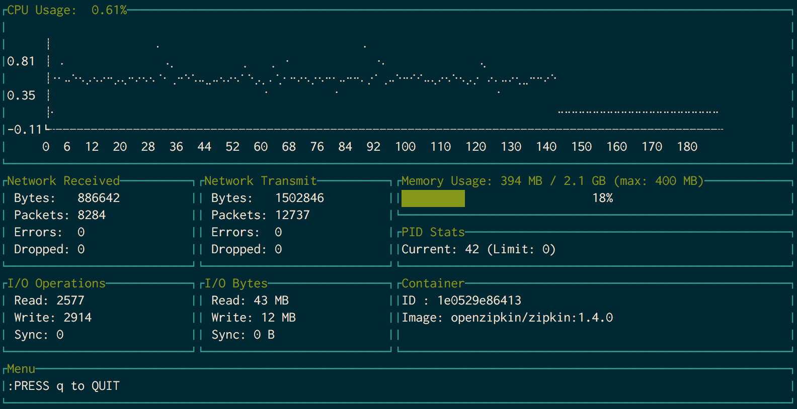

#Docker-Stats

Command-line utility for displaying Docker container stats. 

Uses Docker's [remote API](https://docs.docker.com/engine/reference/api/docker_remote_api/) to obtain container stats and other information and presents it in a terminal-based dashboard.

The dashboard displays:

- CPU Usage (%) + CPU Usage over time (line chart)
- Memory Usage
- Network Usage
- Block IO stats

Dependencies:

- [gizak/termui](https://github.com/gizak/termui) 
- [dustin/go-humanize](github.com/dustin/go-humanize)
- [docker/engine-api](github.com/docker/engine-api)

